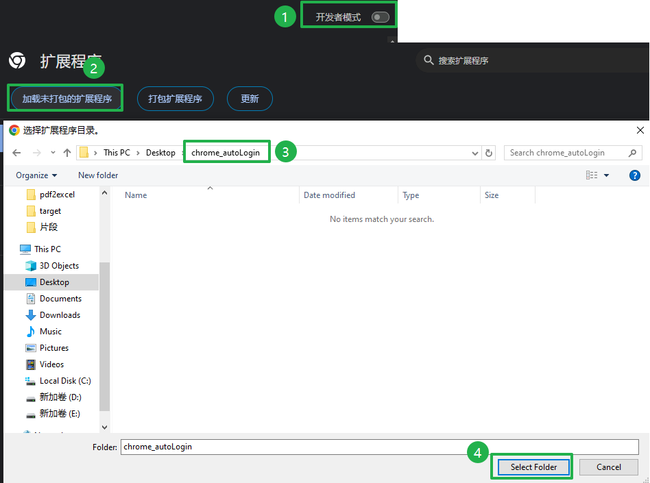
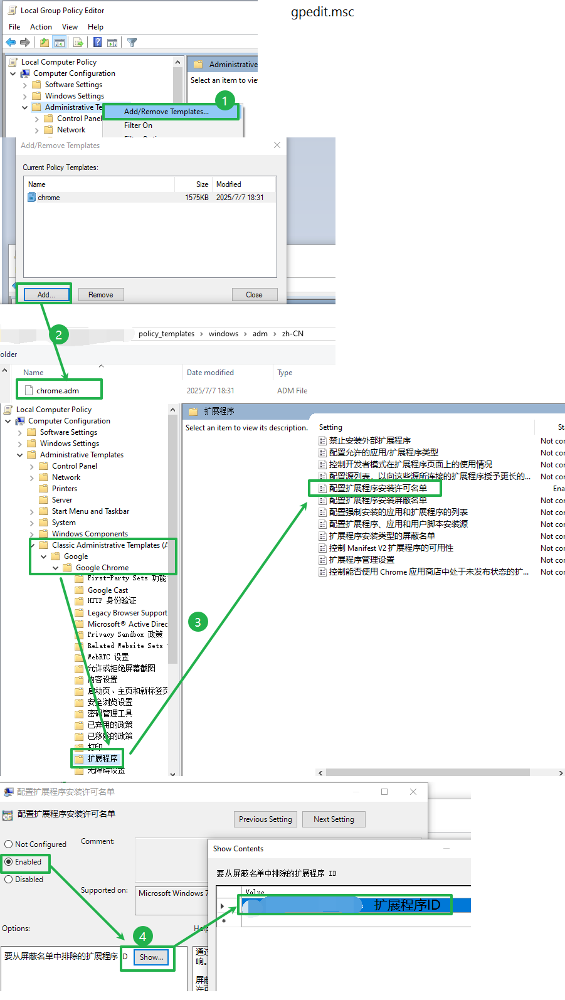
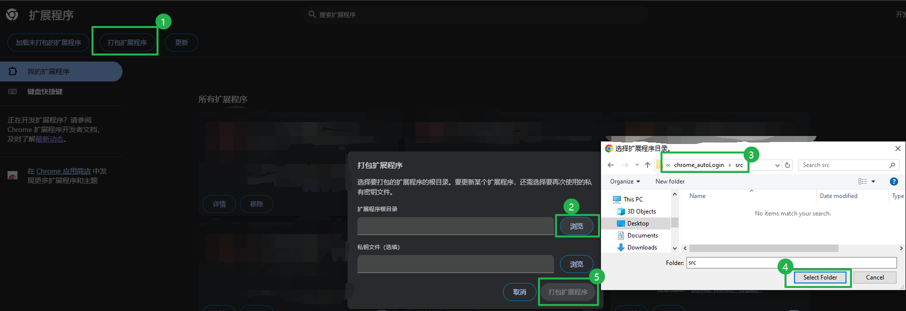

## Chrome浏览器扩展

在满足指定页面的条件下，进行密码自动填充和登录按钮的点击

### 安装方式

- 使用源码直接安装

   打开开发者模式，直接选中源码文件夹或者把crx后缀修改为zip安装。
   

- 通过配置策略，指定白名单
  
  [adm下载地址](https://support.google.com/chrome/a/answer/187202)
  
  

  ### 打包方式

  